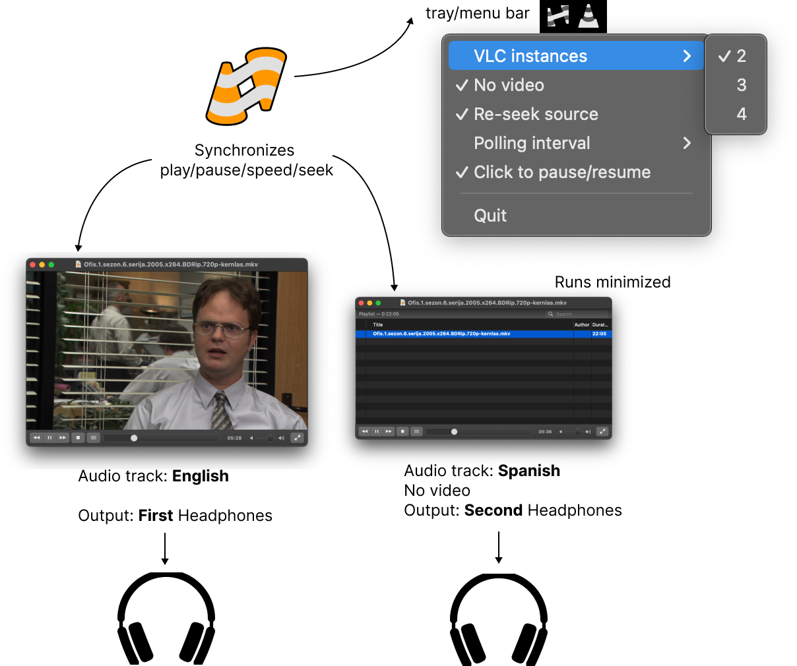

# vlc-sync-play

The easiest way to synchronize multiple VLC players playback.

## Why I need this?

I created it to watch movies with my girlfriend on one screen but listening to 2 different audio tracks.
Each of us has a pair of earphones and each listens to its own audio track. 

The key feature is that they are **synchronized**. 

I can pause, play, seek, and the other player will do the same.

## How to use?

1. Download the [release](https://github.com/cardinalby/vlc-sync-play/releases/latest) for your OS. Supported platforms:
   - Windows
   - MacOS
   - Linux
2. Run it somehow (on MacOS you need to allow running unsigned app in the system settings):
   - You will see the tray / menu bar icon.
   - VLC player gets opened
3. Open a video file in VLC player.
4. Additional VLC player window will be opened with the same file
5. Setup audio tracks / output devices for each VLC player
6. Enjoy! They will play in sync

## Limitations
- Only 2, 3 or 4 players are supported
- File should be the same

## Settings
Tray / menu bar icon allows you to configure the application:

### ⛭ VLC Instances
A number of desired VLC players. At start, the application will open one player. After you have opened a file,
additional players will be opened.

### ⛭ No video
Start new instances with video track disabled

### ⛭ Re-seek source
It's a setting for an internal algorithm to keep players in sync. 
It gives more precise sync but may cause more frequent re-seeks, disable if you experience jittery sync.

### ⛭ Polling interval
The interval of players status polling for the internal algorithm. Lower values give the better precision and 
responsiveness but may cause more CPU usage.

### ⛭ Click to pause/resume
It has nothing to do with synchronization, it's just a convenient option to pause/resume all players by 
clicking on the image (like on YouTube)